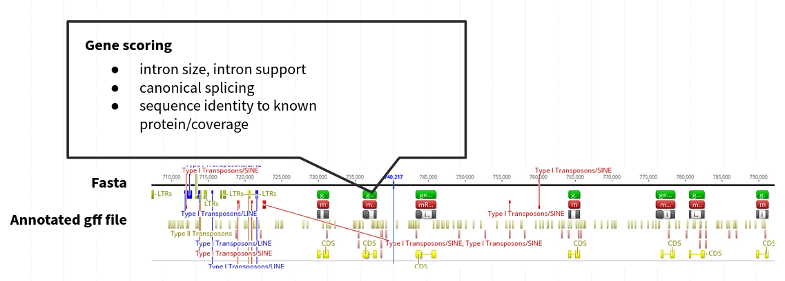
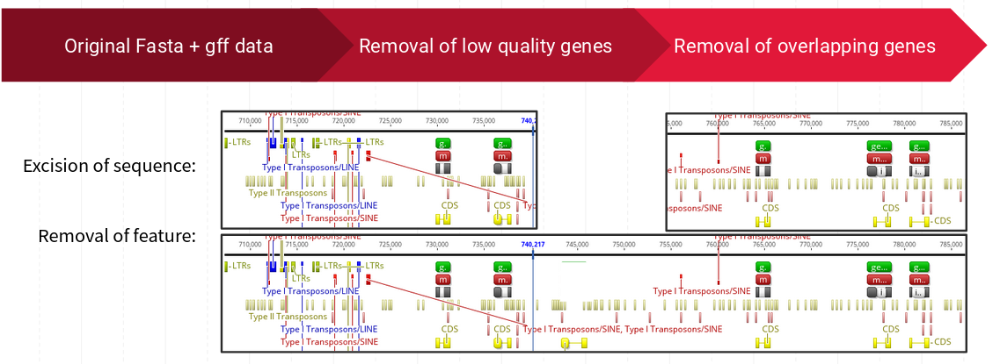
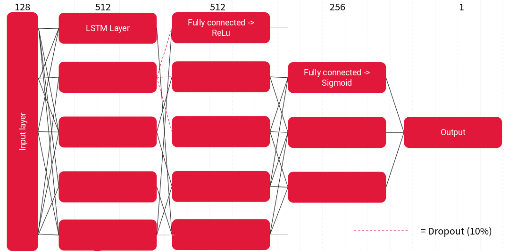
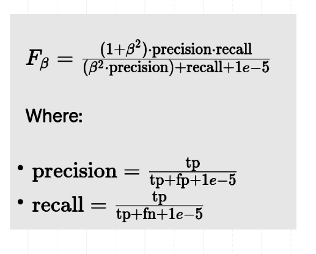

# Google Summer of Code-2023 : Ensembl-Repeat-Identification
#### A Deep Learning repository for predicting putative gene containing regions in mammal genomes.

[](https://github.com/dwyl/esta/issues)

[](https://github.com/idealo/image-super-resolution/blob/master/LICENSE)
### Mentors : [Leanne Haggerty](https://www.ebi.ac.uk/people/person/leanne-haggerty/), [Fergal Martin](https://www.ebi.ac.uk/people/person/fergal-martin/) <br/><br/>

## Brief Description
Accurate gene annotation in eukaryotic genomes using only genomic data remains a pivotal challenge, especially with the influx of data from next-generation sequencing. Traditional methodologies either lean on homology-based searches, posing inaccuracies when working with unique genomes, or incorporate additional experimental datasets like transcriptomics, which can be resource-intensive. To address these limitations, this Google Summer of Code project harnesses deep learning techniques to enhance the precision of gene identification based solely on DNA sequence characteristics. It involves a high-confidence training dataset derived from mammalian genomes. These genomes underwent a rigorous process of identifying top-tier genes, which were then meticulously filtered to ensure quality and relevance for model training. Utilizing this curated dataset, various deep learning network architectures were be implemented, tested, and optimized to try to push the boundaries of gene detection accuracy from inherent DNA sequence features.


## Requirements for Running the Code

**Environment**: 

- 🖥️ Primarily designed for **high-performance computing (HPC)** with an LSF scheduler.
- 💻 Can also be executed on a **personal computer**, albeit for significantly smaller datasets (the genome fetching step works solely from EMBL EBI servers though).


**Hardware Recommendations**:

- 🎮 **GPU**: 
  - A recent model is highly recommended for optimal performance.
  
- 🧠 **Memory**:
  - **GPU Memory**: At least **12 GB RAM** is advised, for the complexer models **25 GB RAM**.
  - **System RAM**: 
    - Tested on a machine with **64 GB RAM**.
    - A minimum of **32 GB RAM** should be sufficient, though **64 GB** is optimal.
  - **System hard drive**
    - To save all genomes of the mammal database and process them, aroung **500 GB** of memory are needed.

> 🔴 **Note**: Running on systems with specifications lower than recommended might result in performance issues or potential failures.

### Installing Perl dependencies (only needed to use Ensemble API to fetch genomes and evaluate gene quality)

Perl is a versatile and widely used programming language, and Ensembl offers a rich set of APIs written in Perl for bioinformatics applications. Here's a guide on how to install Perl and the necessary Ensembl dependencies:

### 1. Install Perl

Most Linux distributions come with Perl pre-installed. However, to ensure you have the latest version:

```bash
sudo apt-get update
sudo apt-get install perl
```
### 1. Install Ensemble API
Follow those instrcutions to install the Ensemble Perl API:
http://www.ensembl.org/info/docs/api/api_installation.html 

### Installing DIAMOND Aligner (only needed to use Ensemble API to fetch genomes and evaluate gene quality)

**DIAMOND** is a high-performance sequence aligner for protein and translated DNA searches, designed to serve as a drop-in replacement for the BLAST suite of tools. Here's a straightforward method to install it on Linux:

1. **Download and Extract the Precompiled Binary**:

1. Use `wget` to download the DIAMOND binary for Linux and extract:
```bash
wget http://github.com/bbuchfink/diamond/releases/download/v2.1.8/diamond-linux64.tar.gz
tar xzf diamond-linux64.tar.gz
```
2. (Optional) Move the diamond binary to a directory in your $PATH for easier access:
```bash
sudo mv diamond /usr/local/bin/
```

3. Test the installation
```bash
diamond --help
```

### Installing Python and Conda

To set up the required Python environment, start by installing Python 3.8. You can download it from the official [Python website](https://www.python.org/downloads/release/python-380/). Once Python 3.8 is installed, proceed to install `conda`, a powerful package manager. The easiest way to do this is by installing [Miniconda](https://docs.conda.io/en/latest/miniconda.html) which is a lightweight version of Anaconda, tailored specifically for conda. Choose the appropriate version for your OS and follow the installation instructions. 

### Installing CUDA and PyTorch Based on GPU and NVIDIA Drivers

To optimize deep learning tasks on GPUs, NVIDIA provides CUDA, a parallel computing platform. However, the CUDA version you install should be compatible with your NVIDIA driver and the PyTorch version you aim to use.

1. **Identifying GPU and NVIDIA Driver**: 
   - First, check the GPU model with:
     ```
     lspci | grep -i nvidia
     ```
   - Check your NVIDIA driver version with:
     ```
     nvidia-smi
     ```

2. **Installing CUDA**:
   - Visit NVIDIA's official [CUDA Toolkit Archive](https://developer.nvidia.com/cuda-toolkit-archive) to find a suitable CUDA version that's compatible with your driver.
   - Download and install the selected CUDA version, following NVIDIA's instructions.

3. **Installing PyTorch**:
   - PyTorch's installation command varies based on the CUDA version. Visit the official [PyTorch website](https://pytorch.org/get-started/locally/) and select the appropriate CUDA version from the dropdown to get the installation command.
   - Create and activate a conda enviroment:
```bash
conda create --name dl_protein_coding_genes python=3.8
conda activate dl_protein_coding_genes
```
   - Use the provided `conda` command to install PyTorch.

> **Note**: Always ensure compatibility between NVIDIA driver, CUDA, and PyTorch versions to avoid issues. You can also consider using Docker with NVIDIA's provided containers to manage these dependencies effortlessly.

### Installing remaining packages

After `torch` is set up, you can create a new environment and install packages from the `requirements.txt` file using the following commands:

```bash
conda activate dl_protein_coding_genes
conda install --file requirements.txt
```
## Parts of the Project

### Fetching Genomes and Evaluating Gene Quality

Contained within the `Ensembl_api_training_data_download_and_gene_confidence_calculation` directory is the initial step of this project. This phase encompasses:

- **Data Fetching**: Via the Ensembl API, genomic data specified in `server_list.txt` is accessed. This operation is managed by the main Perl script, `high_confidence_genes_gsoc23_full_gff_with_repeats_with_strand.pl`. Data is exclusively fetched from servers accessible within the EMBL EBI HPC. 

- **Diamond Coverage Calculation**: Upon data retrieval, `get_diamond_coverage.py` calculates the diamond coverage of genes against a human gene reference database.

- **Gene Annotation Quality Evaluation**: Annotations are analyzed by `high_confidence_genes_gsoc23_full_gff_with_repeats_with_strand.pl` based on parameters like intron size, canonical splicing, and alignment with recognized proteins. The outputs are organized into:
  - `.fasta` format for genomic sequences
  - `.gff` format for gene annotations, including genes, exons, introns, UTRs, and repeat features
  - `.csv` format detailing gene quality metrics

For processing multiple genomes on the EMBL EBI HPC platform, a script in the `run scripts` directory is provided to facilitate batch processing.


***Figure 1**: Gene Annotation Quality Evaluation*

*Annotations are analyzed by `high_confidence_genes_gsoc23_full_gff_with_repeats_with_strand.pl` based on parameters like intron size, canonical splicing, and alignment with recognized proteins.*

### Cleaning up Genomes

During the data preparation phase, two principal methodologies are employed:

1. **GFF-Only Filtering**: A technique that refines `.gff` annotations without tampering with the sequences. It is posited that low-quality genes are likely pseudogenes and do not code for proteins. Thus, classifiers are trained on them as "intergenic regions".
2. **GFF Filtering & Sequence Excision**: An in-depth approach that addresses both `.gff` annotations and associated sequences, eliminating those identified as lower confidence. It is based on the premise that insufficient information exists about low-quality genes, so they are excluded from the training data.

The `Training_data_cleaning` directory is pivotal for this process:

- **GFF Filtering**:
  - **Files**: `filter_gff*`
  - **Function**: Exclusively refines the `.gff` files.

- **Sequence Excision**:
  - **Files**: `remove_*_genes.py`
  - **Function**: Excludes sequences associated with low confidence from the `.fasta` files while filtering the `.gff` files.

- **Gene Refinement**:
  - **Files**: `*overlapping*`, `*low_confidence*`
  - **Function**: Removes overlapping genes and those tagged as low confidence from the annotations.

- **GFF Correction**:
  - **Files**: `correct_gff_files.py`
  - **Function**: Cleans erroneous features, ensuring the `.gff` files' integrity.

Furthermore, the `Nextflow_data_preprocession` directory contains a Nextflow pipeline that merges data acquisition and the above cleaning steps. This integrated solution prepares high-quality training data, although stability might vary.


***Figure 2**: Gene Annotation Quality Evaluation*
*This figure illustrates two strategies for refining gene annotations and associated sequences. The first strategy, **GFF-Only Filtering**, focuses on improving `.gff` annotations while preserving sequence integrity. It hypothesizes that low-quality genes might be pseudogenes without protein-coding capacity. Such genes are treated as "intergenic regions" during classifier training. The second strategy, **GFF Filtering & Sequence Excision**, takes a more comprehensive approach by addressing both `.gff` annotations and linked sequences. It excludes elements of lower confidence due to limited information about low-quality genes, which are consequently omitted from training data. The process of gene annotation refinement involves the removal of low-quality and overlapping genes.* 

### Feature Extraction and Sequence Fragmentation

- **Sequence Fragmentation**: Genomic sequences are divided into 250 base pair (bp) fragments using `data_preprocession.py` and its enhanced counterpart, `data_preprocession_with_size_redistribution.py`. The latter outputs data in a structure where each line corresponds to a 4000*250 bp stretch.

- **First Approach - K-mer Content Calculation**: The 250 bp fragments are assessed to identify their k-mer content, which offers insights into DNA subsequence composition and frequency.

- **Second Approach - One-hot Encoding of DNA Sequences**: This strategy, bypassing the k-mer content assessment, directly converts the 250 bp segment into a one-hot encoded 2D matrix. This encoding encompasses all potential DNA bases, ensuring a thorough representation of sequence data. 

The `Scripts_for_training_data_assembly/Scripts_to_start_jobs/run_data_preprocession_and_test_train_split.py` script is available for a directory that includes corresponding gff and fasta files. It facilitates data division into test and training datasets followed by featurization.

### Deep learning architectures used to distinguish gene- from non-gene-sniplets
### Sequence Classification

Contained within the `Sequence_classification` directory, this segment of the project primarily deals with deploying neural networks to predict the exon status of 250 bp sequences.

- **Conditional Random Fields (CRF)**:
  Conditional Random Fields (CRFs) are a class of statistical modeling methods often employed for structured prediction. Within the domain of sequence labeling, such as in natural language processing tasks like named entity recognition and part-of-speech tagging, CRFs have been pivotal. Their strength lies in their capacity to consider both local and global contextual information, allowing them to discern intricate patterns and dependencies in sequential data.

  - **Files**: `*crf*`

  - **Sklearn Implementation**:
    - **Overview**: Adopting the CRFsuite integrated into sci-kit-learn through `sklearn-crfsuite`, the project creates a sequence labeling environment. This approach is reminiscent of an EMBL team's method to identify putative biosynthetic gene clusters using the GECCO algorithm.
    - **Challenges**: The Sklearn approach, while comprehensive for smaller datasets, struggles with scalability due to its lack of batching capabilities, rendering it suboptimal for extensive datasets like the mammal genomes dataset.

  - **PyTorch Implementation**:
    - **Overview**: Parallel to the Sklearn strategy, the PyTorch implementation exploits the prowess of this deep learning framework. A simple feed-forward neural network or a lstm neural network (later versions) first extracts features, succeeded by a CRF layer for sequence labeling. This merger attempts to amalgamate the nuances of neural networks with the sequencing capability of CRFs.

      - **Architecture Description (LSTM Version)**:

        - **Feature Extraction**:
          - **LSTM Layer**: An LSTM layer is employed for processing sequences, capturing both forward and backward dependencies due to its bidirectional nature.
          - **Linear Layer**: This layer transforms the outputs of the LSTM layer, doubling the dimension because of the bidirectionality, and maps them to a space that corresponds to the number of tags.
        - **CRF Layer**:
          - The CRF layer works on top of the extracted features and decides on the most probable sequence of tags, taking into account both the LSTM's predictions and the transition probabilities between different tags. This ensures that the predicted sequence tags have a global coherence and are not just based on local decisions.

    - **Challenges**: The PyTorch-based CRF's inherent loss function gauges the accuracy of the entire predicted sequence. This can be problematic for highly imbalanced datasets, as the sequence-wise loss might disproportionately penalize specific predictions, especially when positive class instances are sparse compared to negative instances. I tryed to adjust weights for different predicitons, but this never really fixed the problem of the classifier always classifying everything as a "non-gene".

- **Long-Short-Term-Memory Neural Networks (LSTMs)**:
  
  - **Files**: `*lstm*`
  
  - **Overview**: Renowned for their adeptness in managing sequential data, LSTMs stand as a pivotal architecture within this project. The vanguard script driving this architecture is `lstm_classifier_pytorch_one_gpu_with_line_shuffling.py`.

  - **Architecture Description**:
    - **Layers**:
      - **LSTM Layer**: A multi-layered bidirectional LSTM, it's designed to process sequences with diverse lengths, allowing both forward and backward information to flow.
      - **Intermediate Fully Connected Layer (FC1)**: Maps the LSTM outputs to an intermediate space, priming them for final classification.
      - **Dropout Layer**: Positioned after the FC1 layer, this layer aims to prevent overfitting by randomly setting a fraction of input units to 0 at each update during training.
      - **Final Fully Connected Layer (FC2)**: Transforms the processed LSTM outputs into a final space with a single output dimension, primed for binary classification.

    - **Activation & Initialization**:
      - `kaiming_normal_` initialization is used on both fully connected layers, providing optimized initial weights for 'relu' activated layers.
      - A sigmoid activation function is applied post FC2, translating outputs to probabilities, making it apt for binary classification tasks.


***Figure 3**: BiLSTM architecture*

*The network comprises of multiple layers: **LSTM Layer**: Comprising multiple bidirectional LSTM layers, this component efficiently handles sequences of varying lengths, facilitating bidirectional information flow for enhanced context understanding. **Intermediate Fully Connected Layer (FC1)**: This layer transforms LSTM outputs, mapping them to an intermediate space that prepares them for the final classification step. **Dropout Layer**: Placed after FC1, the dropout layer introduces randomness by setting a fraction of input units to 0 during each training update. This mechanism helps prevent overfitting by promoting robust learning. **Final Fully Connected Layer (FC2)**: The last layer of the architecture, FC2, transforms the processed LSTM outputs into a one-dimensional space, effectively priming them for binary classification tasks.*
    
  - **Loss Function - F-beta Score**:
    - The F-beta score, a measure of a model's accuracy, weighs recall and precision of the "gene" class. This makes it better suitable for unbalanced datasets. A beta of 1 considers both recall and precision equally, but when adjusted, it can emphasize the importance of one over the other.



***Figure 4**: F-beta loss*

*Controlled by the parameter beta, the F-beta loss adapts precision-recall balance. Beta influences the weight assigned to recall in relation to precision. A higher beta places more emphasis on recall, capturing more positives even if accompanied by increased false positives. Conversely, a lower beta prioritizes precision, reducing false positives but potentially missing positives. The F-beta loss formula incorporates true positives (TP), false positives (FP), and false negatives (FN). This integration enables models to optimize the trade-off between false positives and false negatives, enhancing performance on imbalanced datasets.*

- **Shallow Learning Approaches**:
  - **Files**: `shallow-learning`
  - **Overview**: Primarily a platform for debugging, this encompasses the implementation of SGDClassifiers.

- **Run Data**:
  - **Directory**: `runs`
  - **Description**: This section consolidates data across various runs, facilitating introspection via TorchBoard.

### Direct 250 bp Sequence Embedding

Previously, the approach centered on the k-mer content of sequences for analysis. However, in a alternative approach, the clasifier directly inputs the full 250 base pair (bp) sequence, one hot encoded in a 2d matrix.

#### Advantages:
- **Data Completeness:** Providing the entire sequence ensures no overlooked information, unlike the summarized k-mer data.

#### Challenges:
- **Increased Model Size:** By inputting the entire sequence, the model's dimensions grow substantially. This increase:
    - Elevates memory consumption.
    - Reduces the permissible batch sizes, potentially affecting computational efficiency.

#### Architectural Modifications:
With the change in input strategy, there's an imperative need to reconfigure the network architecture. Direct sequence submission often necessitates:
- Larger input layers to accommodate the expanded sequence data.
- More complex convolutional or recurrent layers to capture sequence dependencies.

### Exon-rich Region Concatenation and Analysis

The overall process seeks to detect and concatenate tokens indicative of exon status, generating more expansive, exon-rich regions in genomic sequences. The main steps of this process are:

- **Parameter Initialization**: Specific thresholds and parameters, such as the seed size and padding, are predetermined. These play crucial roles in the identification and expansion of target regions within the DNA sequence.

- **Seed Identification and Expansion**: A sliding window approach is used to identify "seed" regions that have a high density of exon-predicted tokens. Once these seeds are pinpointed, the boundaries are expanded outwards. This expansion proceeds as long as the density of exon-predicted tokens within the growing region remains above the pre-established threshold.

- **Sequence Processing from FASTA Files**: DNA sequences, and their reverse complements, are extracted from FASTA files. Both strands of the DNA (forward and reverse) undergo the above seed identification and expansion process.

- **Boundary Padding**: After target regions (with high exon content) are identified, an additional sequence (padding) is added around these regions. This ensures that potential exon boundaries close to the identified regions are not missed.

- **Consolidation and Output**: The identified exon-rich regions, from both strands, are systematically catalogued. Attributes include the specific sequence, its position (start and end points), and whether it's from the forward or reverse strand. This consolidated data can then be saved for further analysis or representation.

# Challenges

Genomic analysis in eukaryotic organisms presents distinctive challenges. Unlike prokaryotic genomes, eukaryotic genomes are typically extensive and contain complex structures like introns, exons, transposons, and repetitive elements. Capturing the variations and intricacies within these genomes demands vast training data.

Managing such large datasets introduces its own hurdles. Memory allocation becomes a significant challenge. Conventional computational frameworks often struggle with efficiently storing, retrieving, and processing this scale of data without notable latency. The vastness of the training data also results in prolonged training durations, potentially slowing down iterative model development.

Moreover, it's vital to ensure that the data represents the full spectrum of genomic sequences. Any biases or oversights can introduce inaccuracies in the subsequent analyses. Thus, while eukaryotic genomes offer a plethora of information, they also necessitate advanced computational solutions to overcome the inherent challenges in data management and analysis.

# Outlook


As the project unfolded, we quickly realized that the coarse-grained feature extraction was a more intricate puzzle than initially anticipated. Despite our diligent efforts, the complexity and nuances associated with this task proved to be quite the challenge. Due to the unforeseen hurdles in this phase, we didn't progress to the fine-grained feature extraction and the subsequent deep learning model as originally planned.

However, every challenge presents a new opportunity. While we might not have covered every milestone we set out to achieve in this timeframe, the experiences and knowledge garnered set a solid foundation for the journey ahead. I'm genuinely excited about the potential future developments and enhancements we can bring to this project.

The past three months have been nothing short of a whirlwind, with time seemingly flying by. The lessons, collaborations, and moments of discovery have been invaluable. I am eager to maintain and grow this collaboration. The initial phase of our collaboration might be wrapping up, but I see this more as a beginning. I'm looking forward to diving back into the challenges and pushing the boundaries of what we can achieve together in the future.


# Final remarks

Taking on this project was genuinely eye-opening. Diving into deep learning with PyTorch provided a unique challenge, but it was packed with insights. The experience of contributing to the open-source community was remarkable; it's a space where collaboration and shared goals truly shine.

Joining the Google Summer of Code program marked a significant milestone in my journey. For anyone intrigued by this realm, it's a worthy pursuit. Tackling challenges like managing extensive training data and navigating memory issues underscored the complexity of eukaryotic genomes.

When it comes to my mentors, I can't emphasize enough how instrumental they were to my journey. Their perfect balance of expertise and approachability truly enhanced the learning experience. Beyond just offering guidance, they provided insights, shared valuable experiences, and consistently encouraged my growth. Collaborating with such knowledgeable and supportive figures was undoubtedly a cornerstone of this project's success. Their influence has left a lasting positive impact on my professional journey.


In conclusion, this project was an enriching experience. Beyond the practical skills, I've come away with a profound appreciation for the power of collaboration in research.


